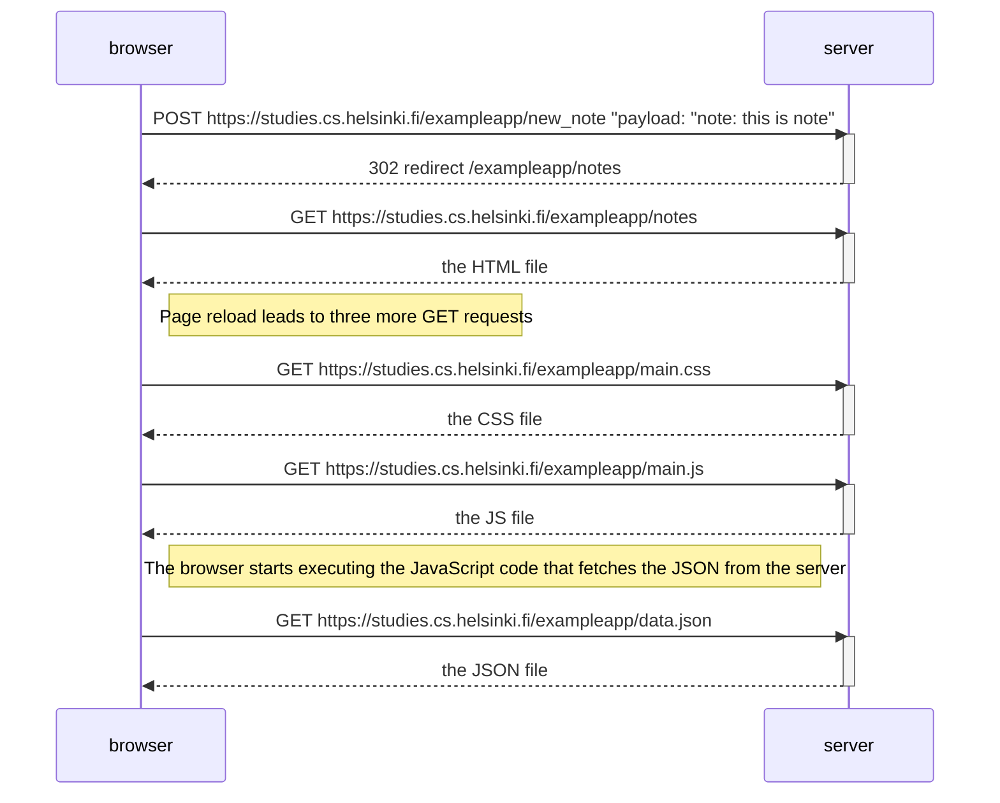

```mermaid
    sequenceDiagram
        participant browser
        participant server
        
        browser->>server: POST https://studies.cs.helsinki.fi/exampleapp/new_note "payload: "note: this is note"
        activate server
        server-->>browser:  302 redirect /exampleapp/notes
        deactivate server
        
        browser->>server: GET https://studies.cs.helsinki.fi/exampleapp/notes
        activate server
        server-->>browser: the HTML file
        deactivate server

        Note right of browser: Page reload leads to three more GET requests
        
        browser->>server: GET https://studies.cs.helsinki.fi/exampleapp/main.css
        activate server
        server-->>browser: the CSS file
        deactivate server
        
        browser->>server: GET https://studies.cs.helsinki.fi/exampleapp/main.js
        activate server
        server-->>browser: the JS file
        deactivate server    
        
        Note right of browser: The browser starts executing the JavaScript code that fetches the JSON from the server

        browser->>server: GET https://studies.cs.helsinki.fi/exampleapp/data.json
        activate server
        server-->>browser: the JSON file
        deactivate server  
```   
