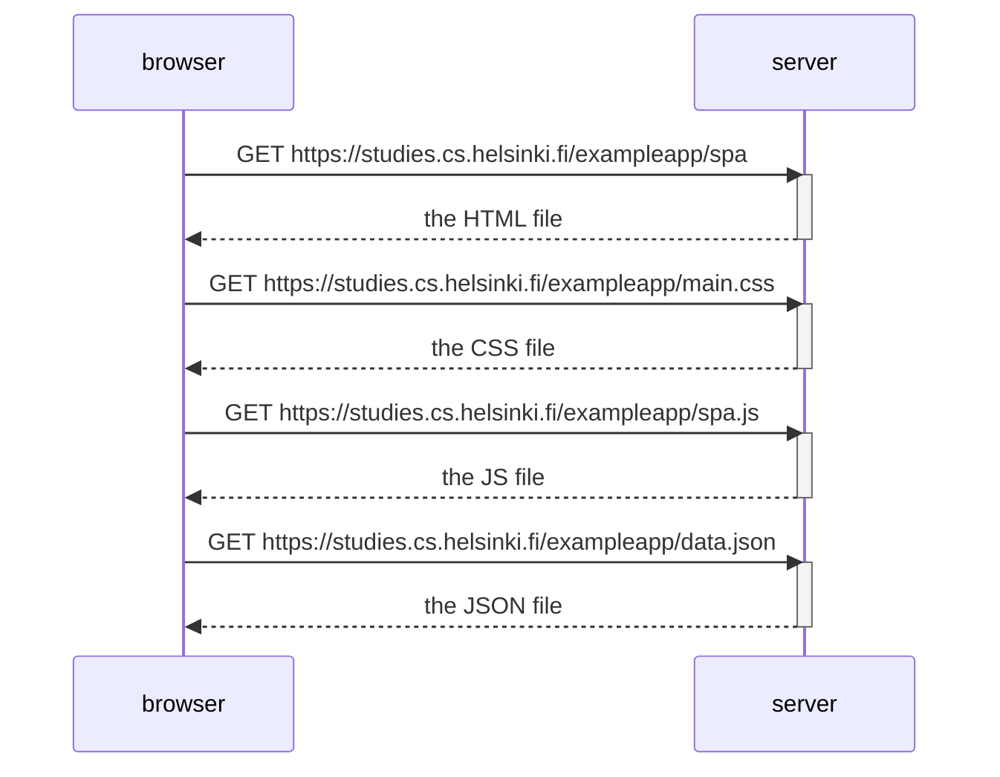

```mermaid
    sequenceDiagram
        participant browser
        participant server
        
        browser->>server: GET https://studies.cs.helsinki.fi/exampleapp/spa
        activate server
        server-->>browser:  the HTML file
        deactivate server
        
        browser->>server: GET https://studies.cs.helsinki.fi/exampleapp/main.css
        activate server
        server-->>browser: the CSS file
        deactivate server
        
        browser->>server: GET https://studies.cs.helsinki.fi/exampleapp/spa.js
        activate server
        server-->>browser: the JS file
        deactivate server
        
        browser->>server: GET https://studies.cs.helsinki.fi/exampleapp/data.json
        activate server
        server-->>browser: the JSON file
        deactivate server    
```   
